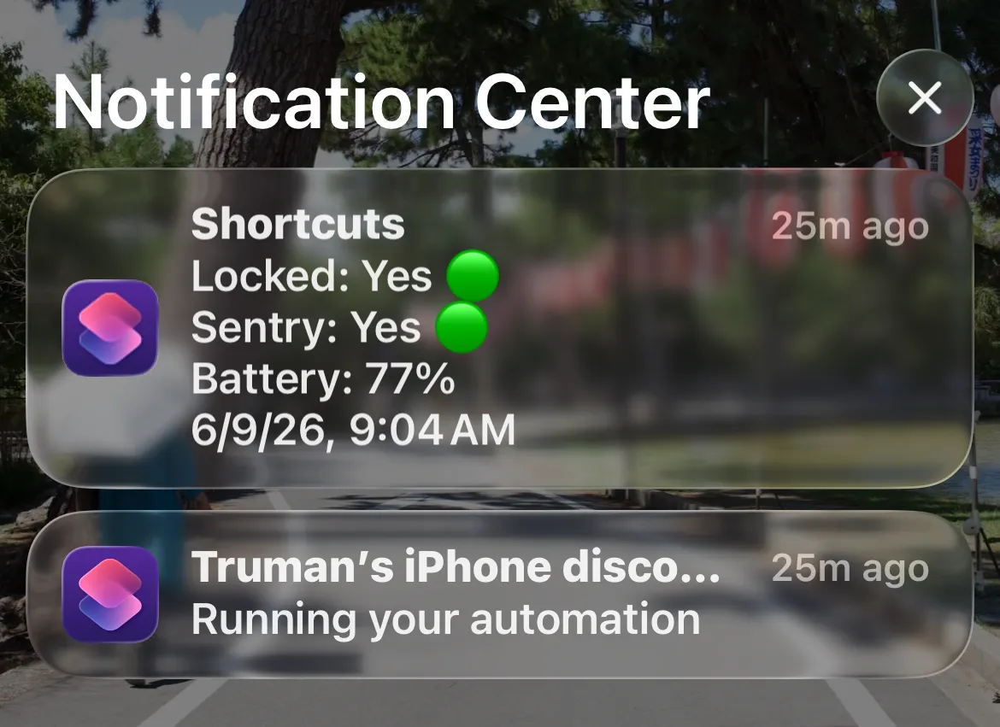
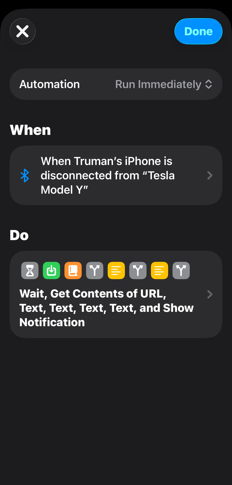
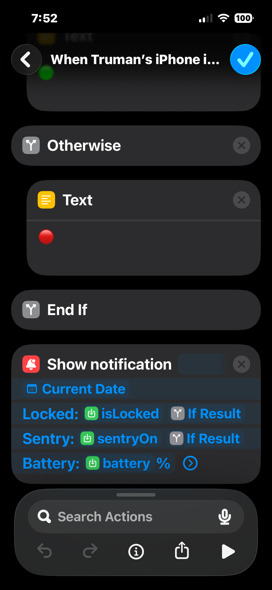
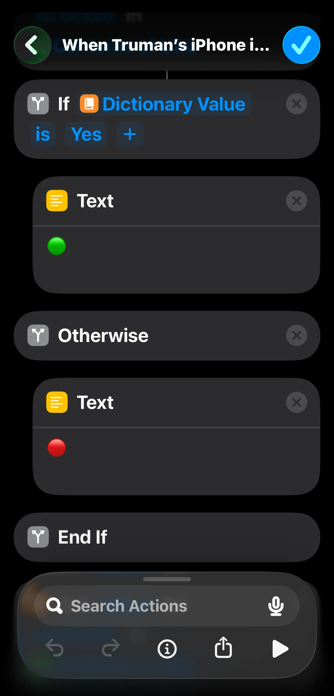
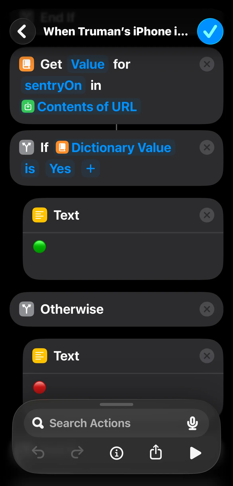
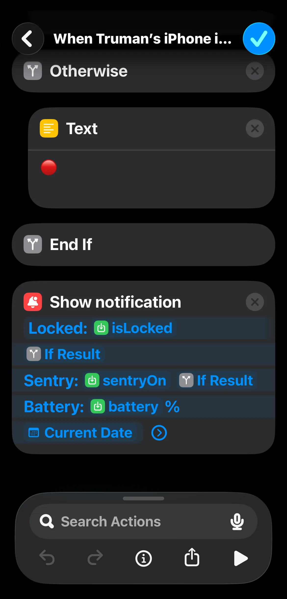

# Tesla Sentry State
<div align="center">
  
</div>

In Tesla vehicles, a Home location can be saved on the touchscreen. There is a setting for excluding automatically turning on sentry mode when parking at Home. The problem with this setting is there is no way of specifying or knowing how big the geofence of Home is. There were a few times where I'd park out on the sidewalk, even more than half a block away, and I'd discover hours later that my sentry mode was never turned on. I finally committed to this project after discovering more than half a day went by with my sentry mode off, and a car's license plate frame right up against my rear bumper. An near-instant notification to my phone confirming the car's lock state, sentry state, and battery level when I park my car and walk away would be incredibly useful.

Initially I wanted to try setting up Tesla Fleet Telemetry with Discord Webhooks which would broadcast state changes instantly while keeping API calls low. I got very close but ultimately was not able to figure out how to configure Fleet Telemetry properly (config was set properly but synced:false and there were telemetry errors such as bad handshake). Still event-based, I ended up going with Fleet API since it was already set up and worked fine, and iOS Shortcuts for sending notifications to my phone. The Shortcuts automation detects when the bluetooth connection with my car disconnects, and sends a GET request on the /trigger-sync endpoint.

## App Workflow
1. Navigate to /auth endpoint. Successful callback generates new auth tokens and updates the row in D1 tokens table.
2. Get in car and drive. If already set up, bluetooth connection with Tesla vehicle automatically starts.
3. Park and walk away. Bluetooth disconnects from the car, triggering the iOS Shortcuts automation which first runs the 10s wait block. Car locks soon after. After wait block finishes, receive push notification of the lock state, sentry state, and battery level along with the date and time.
> **Note:** After wait block finishes, if the access token expired, new auth tokens update D1 tokens row and is used subsequently for persistence.

---

<details>

<summary>Local Development</summary>

### Requirements:
* [Fleet API steps 1-4, and set up Virtual Key with vehicle](https://developer.tesla.com/docs/fleet-api/getting-started/what-is-fleet-api)
    * Fleet API app with scope: Vehicle Information
    * OAuth scopes: openid, offline_access, vehicle_device_data
    * App name shows up under Third-Party Apps in Tesla account
* Cloudflare Worker built with Wrangler
* Cloudflare D1 database to store auth tokens - connect through wrangler.jsonc, and apply schema.sql
* public-key.pem served on a specific endpoint
* All .env variables stored in Cloudflare Worker as Secrets
* X-API-Key in iOS Shortcut automation > Get contents of > GET request's Header

> **Note:** If your fleet_telemetry_config response looks like the below then you are done with all Tesla steps.
```json
{
  "response": {
    "synced": true,
    "config": null,
    "limit_reached": false,
    "key_paired": true
  }
}
```

---

### Run locally

Node v24+
```
git clone https://github.com/trumanjchan/tesla-sentry-state.git
npm install
npx wrangler login
```

Your `.env` file should have variables:
```
TESLA_PUBLIC_KEY
TESLA_PRIVATE_KEY

TESLA_CLIENT_ID
TESLA_CLIENT_SECRET
TESLA_REDIRECT_URI

MY_SECRET_API_KEY
TESLA_VIN
```

Navigate to `http://localhost:8787/`

---

### iOS Shortcuts Automation

<div align="center">
  
  
  
  
  
</div>

</details>